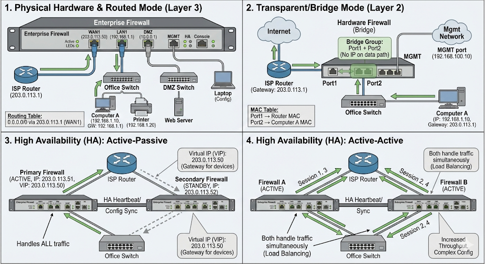

# Hardware Firewall Deployment: Practical Implementation Guide

## Table of Contents
1. [Physical Hardware Overview](#physical-hardware-overview)
2. [Deployment Mode 1: Routed Mode (Layer 3)](#deployment-mode-1-routed-mode-layer-3)
3. [Deployment Mode 2: Transparent/Bridge Mode (Layer 2)](#deployment-mode-2-transparentbridge-mode-layer-2)
4. [High Availability (HA) Setups](#high-availability-ha-setups)
5. [Practical Deployment Scenarios](#practical-deployment-scenarios)
6. [Configuration Examples](#configuration-examples)
7. [Troubleshooting Common Issues](#troubleshooting-common-issues)

---

## Physical Hardware Overview

### What Does a Hardware Firewall Look Like?
- A DMZ (Demilitarized Zone) in networking is a physical or logical subnetwork that acts as a buffer between a trusted internal network (LAN) and an untrusted external network, typically the internet.
-  MGMT: A management network is a privileged network which typically only the network admin team should have physical access to.
-  USB: universal serial bus
```
[FRONT PANEL - Typical Enterprise Firewall]

┌─────────────────────────────────────────────────────────┐
│  FORTINET FortiGate 100F                    [PWR] [SYS] │
│                                                         │
│  WAN1 [●]  WAN2 [●]  DMZ [●]  LAN1-8 [●●●●●●●●]         │
│  (Eth0)    (Eth1)    (Eth2)   (Eth3-10)                 │
│                                                         │
│  MGMT [●]  USB [●]  HA [●]  Console [●]                 │
└─────────────────────────────────────────────────────────┘

BACK PANEL:
- Power Supply 1 & 2 (redundant)
- Cooling fans
- Kensington lock slot
```

### Interface Types

**Physical Ports on Firewall:**
- **WAN ports**: Connect to internet (ISP router/modem)
- **LAN ports**: Connect to internal network (office switches)
- **DMZ port**: Connect to semi-trusted network (public servers)
- **Management port**: For admin access only
- **HA port**: For high availability sync with backup firewall
- **Console port**: Serial connection for initial setup

**Cable Types:**
- Ethernet cables (Cat5e/Cat6/Cat6a)
- Fiber optic (for high-speed WAN connections)
- Serial cable (for console access)

---

## Deployment Mode 1: Routed Mode (Layer 3)

### What Is Routed Mode?

The firewall **acts as a router** between different networks. It has IP addresses on all interfaces and makes routing decisions.

**Think of it as**: A traffic cop at an intersection directing cars between different streets.

### Physical Topology

```
INTERNET
   │
   │ [Public IP: 203.0.113.1]
   ↓
[ISP Router]
   │ 
   │ [Public IP: 203.0.113.50]
   ↓
┌──────────────────────────────────┐
│   HARDWARE FIREWALL (Routed)     │
│                                  │
│  WAN: 203.0.113.50               │
│  LAN: 192.168.1.1                │  ← This is the default gateway for office
│  DMZ: 10.0.0.1                   │
└──────────────────────────────────┘
   │              │              │
   ↓              ↓              ↓
Internal      DMZ Switch    Guest WiFi
Network       (10.0.0.x)    (192.168.99.x)
(192.168.1.x)
   │
   ↓
[Office Switch]
   │
   ├─ Computer A: 192.168.1.10
   ├─ Computer B: 192.168.1.11
   └─ Printer: 192.168.1.20
```

### Step-by-Step Physical Connection

**1. Connect ISP to Firewall WAN Port**
```
ISP Router/Modem (Eth port) ──[Cat6 cable]──> Firewall WAN1 port
```

**2. Connect Office Switch to Firewall LAN Port**
```
Firewall LAN1 port ──[Cat6 cable]──> Office Switch (Uplink port)
```

**3. Connect Management Laptop (for initial config)**
```
Laptop ──[Cat6 cable]──> Firewall MGMT port
```

**4. Power on Firewall**
```
Connect power cable → Wait 2-3 minutes for boot
Look for: Green LED on ports, Solid system LED
```

### IP Addressing in Routed Mode

```
┌─────────────────────────────────────────────────────────────┐
│ Network Segment    │ IP Range          │ Gateway            │
├─────────────────────────────────────────────────────────────┤
│ WAN (Internet)     │ 203.0.113.50/30   │ 203.0.113.1 (ISP)  │
│ LAN (Internal)     │ 192.168.1.0/24    │ 192.168.1.1 (FW)   │
│ DMZ (Web Servers)  │ 10.0.0.0/24       │ 10.0.0.1 (FW)      │
│ Guest WiFi         │ 192.168.99.0/24   │ 192.168.99.1 (FW)  │
└─────────────────────────────────────────────────────────────┘
```

**Firewall has 4 different IP addresses** (one on each interface).

### How Traffic Flows (Routed Mode)

#### Example: Employee browsing Google.com

```
STEP 1: Employee Computer sends packet
  Source: 192.168.1.10:54321
  Destination: 8.8.8.8:443 (Google DNS)
  Gateway: 192.168.1.1 (Firewall LAN interface)

STEP 2: Packet arrives at Firewall LAN port
  Firewall checks routing table:
    "Destination 8.8.8.8 is not in local networks"
    "Send to default route via WAN interface"

STEP 3: Firewall performs NAT (Network Address Translation)
  Changes source IP: 192.168.1.10 → 203.0.113.50 (Firewall WAN IP)
  Changes source port: 54321 → 40123 (random port)
  Records in NAT table:
    192.168.1.10:54321 ↔ 203.0.113.50:40123 → 8.8.8.8:443

STEP 4: Firewall security checks (L3, L4, L7)
  ✓ Source IP allowed? (192.168.1.10 is internal - OK)
  ✓ Destination IP allowed? (8.8.8.8 is Google - OK)
  ✓ Port allowed? (443 HTTPS - OK)
  ✓ Content inspection? (no malware - OK)

STEP 5: Packet exits via WAN port
  Source: 203.0.113.50:40123
  Destination: 8.8.8.8:443

STEP 6: Google responds
  Source: 8.8.8.8:443
  Destination: 203.0.113.50:40123

STEP 7: Firewall receives response on WAN port
  Checks NAT table: "Port 40123 belongs to 192.168.1.10:54321"
  Translates destination: 203.0.113.50:40123 → 192.168.1.10:54321

STEP 8: Response delivered to employee
  Employee receives Google's webpage
```

### Routing Table Example

```bash
# Firewall's Routing Table in Routed Mode

Destination      Gateway         Interface   Metric
0.0.0.0/0        203.0.113.1     WAN1        10      ← Default route (internet)
192.168.1.0/24   0.0.0.0         LAN1        0       ← Directly connected
10.0.0.0/24      0.0.0.0         DMZ         0       ← Directly connected
192.168.99.0/24  0.0.0.0         LAN2        0       ← Directly connected
```

### Configuration Example (Routed Mode)

```bash
# FortiGate CLI Configuration

# 1. Configure WAN interface
config system interface
    edit "wan1"
        set mode static
        set ip 203.0.113.50 255.255.255.252
        set allowaccess ping https ssh
        set role wan
    next
end

# 2. Configure LAN interface
config system interface
    edit "lan1"
        set mode static
        set ip 192.168.1.1 255.255.255.0
        set allowaccess ping https ssh
        set role lan
    next
end

# 3. Configure default route
config router static
    edit 1
        set gateway 203.0.113.1
        set device "wan1"
    next
end

# 4. Configure NAT (hide internal IPs)
config firewall policy
    edit 1
        set name "LAN-to-Internet"
        set srcintf "lan1"
        set dstintf "wan1"
        set srcaddr "all"
        set dstaddr "all"
        set action accept
        set nat enable
    next
end
```

### Pros and Cons of Routed Mode

**✅ Advantages:**
- Full control over routing between networks
- Easy to segment networks (LAN, DMZ, Guest)
- Can do advanced routing (static routes, BGP, OSPF)
- Clear network boundaries
- NAT hides internal IPs from internet

**❌ Disadvantages:**
- Changes IP addressing scheme (firewall becomes new gateway)
- Requires reconfiguring all devices to use firewall as gateway
- More complex to set up initially
- Need to plan IP subnets carefully

**When to Use:**
- ✅ New office network setup
- ✅ Need network segmentation (DMZ, Guest WiFi)
- ✅ Want VPN termination
- ✅ Multiple internet connections (load balancing)

---

## Deployment Mode 2: Transparent/Bridge Mode (Layer 2)

### What Is Transparent Mode?

The firewall is **invisible** to the network. It doesn't have an IP address in the data path and doesn't change routing.

**Think of it as**: A security guard checking IDs at a door - people don't see the guard as part of the building structure.

### Physical Topology

```
INTERNET
   │
   │ [Public IP: 203.0.113.50]
   ↓
[ISP Router: 203.0.113.1]
   │
   ↓
┌──────────────────────────────────┐
│   HARDWARE FIREWALL (Bridge)     │
│                                  │
│   Port1 ←─[BRIDGE]─→ Port2       │  ← NO IP addresses on these!
│                                  │
│   MGMT: 192.168.100.10           │  ← Only for admin access
└──────────────────────────────────┘
   │
   │ [Gateway still 203.0.113.1 - ISP Router]
   ↓
[Office Switch]
   │
   ├─ Computer A: 192.168.1.10 (gateway: 203.0.113.1)
   ├─ Computer B: 192.168.1.11 (gateway: 203.0.113.1)
   └─ Printer: 192.168.1.20 (gateway: 203.0.113.1)
```

### Key Difference: No IP Address on Data Path

```
ROUTED MODE:
Computer → Firewall (192.168.1.1) → Internet
          ↑ Firewall is the gateway

BRIDGE MODE:
Computer → [Firewall (invisible)] → ISP Router (203.0.113.1) → Internet
          ↑ Firewall just filters     ↑ Router is still the gateway
```

### Step-by-Step Physical Connection

**1. Insert firewall BETWEEN router and switch**
```
Before:
ISP Router ──────────────> Office Switch

After:
ISP Router ──> [Firewall Port1] [Firewall Port2] ──> Office Switch
```

**2. Create bridge interface**
```
Port1 + Port2 = Bridge Group 1
(Traffic flows through, but firewall inspects it)
```

**3. Configure management IP (out-of-band)**
```
Management port: 192.168.100.10
Admin connects via separate network to configure firewall
```

### How Traffic Flows (Bridge Mode)

#### Example: Employee browsing Google.com

```
STEP 1: Employee Computer sends packet
  Source: 192.168.1.10:54321
  Destination: 8.8.8.8:443
  Gateway: 203.0.113.1 (ISP Router - NOT the firewall!)

STEP 2: Packet arrives at Office Switch
  Switch forwards to default gateway: 203.0.113.1
  But physically, cable goes through firewall first

STEP 3: Packet enters Firewall Port2 (invisible)
  Firewall operates at Layer 2 (MAC address level)
  Firewall checks:
    ✓ Source MAC: aa:bb:cc:11:22:33 (Computer A)
    ✓ Destination MAC: dd:ee:ff:44:55:66 (ISP Router)
  
  Firewall inspects packet (L3, L4, L7 checks):
    ✓ Source IP: 192.168.1.10
    ✓ Destination IP: 8.8.8.8
    ✓ Port: 443 (HTTPS)
    ✓ Content: No malware

STEP 4: Packet exits Firewall Port1
  MAC addresses unchanged
  IP addresses unchanged
  Packet looks identical to what was received

STEP 5: Packet reaches ISP Router
  Router performs NAT: 192.168.1.10 → 203.0.113.50
  Router forwards to internet

STEP 6: Response comes back same way
  Internet → ISP Router → Firewall (invisible) → Switch → Computer
```

**KEY POINT**: From the computer's perspective, nothing changed. It still thinks ISP Router is the gateway.

### Configuration Example (Bridge Mode)

```bash
# FortiGate CLI Configuration for Transparent Mode

# 1. Create software switch (bridge)
config system switch-interface
    edit "lan-bridge"
        set member "port1" "port2"
        set type switch
    next
end

# 2. Assign management IP to bridge (for admin only)
config system interface
    edit "lan-bridge"
        set mode static
        set ip 192.168.100.10 255.255.255.0
        set allowaccess ping https ssh
    next
end

# 3. Configure firewall policy (still applies!)
config firewall policy
    edit 1
        set name "Allow-Web-Traffic"
        set srcintf "lan-bridge"
        set dstintf "lan-bridge"
        set srcaddr "all"
        set dstaddr "all"
        set service "HTTP" "HTTPS"
        set action accept
        set inspection-mode flow  ← Deep packet inspection
    next
end

# 4. Block specific threats
config firewall policy
    edit 2
        set name "Block-Malware"
        set srcintf "lan-bridge"
        set dstintf "lan-bridge"
        set srcaddr "all"
        set dstaddr "all"
        set service "ALL"
        set action deny
        set ips-sensor "default"  ← Intrusion Prevention
    next
end
```

### MAC Address Table (Layer 2 Operation)

```
Firewall's MAC Learning Table:

Port    | MAC Address        | IP Address    | VLAN
--------|-------------------|---------------|------
Port1   | dd:ee:ff:44:55:66 | 203.0.113.1   | 1     ← ISP Router
Port2   | aa:bb:cc:11:22:33 | 192.168.1.10  | 1     ← Computer A
Port2   | aa:bb:cc:11:22:44 | 192.168.1.11  | 1     ← Computer B
Port2   | aa:bb:cc:11:22:55 | 192.168.1.20  | 1     ← Printer
```

Firewall learns MAC addresses like a switch, but applies security policies before forwarding.

### Pros and Cons of Bridge Mode

**✅ Advantages:**
- Zero configuration changes to existing network
- No IP readdressing needed
- Drop-in security - just plug it in
- Easy to remove if needed (take out firewall, direct connect)
- Doesn't appear in traceroute (invisible)

**❌ Disadvantages:**
- Cannot do NAT (no IP on data path)
- Cannot do routing between different subnets
- Limited network segmentation
- Cannot terminate VPN directly
- No load balancing across multiple WANs
- Harder to troubleshoot (invisible in network path)

**When to Use:**
- ✅ Adding security to existing network without changes
- ✅ Legacy network with fixed IP addressing
- ✅ Compliance requirement (need firewall but can't change IPs)
- ✅ Temporary security while migrating to routed mode

---

## High Availability (HA) Setups

### Why HA Matters

**Single Point of Failure:**
```
Internet ──> [Single Firewall] ──> Office
                    ↓
              [Power failure]
                    ↓
          ❌ ENTIRE OFFICE OFFLINE
```

**With HA:**
```
Internet ──> [Primary Firewall] ──> Office
              ↓ (Heartbeat)
             [Backup Firewall]
                    ↓
          ✅ Automatic failover in 1-3 seconds
```

### HA Mode 1: Active-Passive (Hot Standby)

#### Physical Topology

```
                    INTERNET
                       │
                       │
          ┌────────────┴────────────┐
          │    Network Switch       │
          │    (or ISP Router)      │
          └────────────┬────────────┘
                       │
          ┌────────────┴────────────┐
          │                         │
    [Primary Firewall]         [Secondary Firewall]
    IP: 203.0.113.50           IP: 203.0.113.51
    Status: ACTIVE ✓           Status: STANDBY ⏸
          │                         │
          ├─────[HA Heartbeat]──────┤  ← Dedicated cable
          │                         │
          ├───[Config Sync]─────────┤  ← Same cable or separate
          │                         │
          └────────────┬────────────┘
                       │
                 [Office Switch]
```

#### How It Works

**Normal Operation (Primary Active):**
```
1. Primary firewall handles ALL traffic
2. Secondary firewall stands by, doing nothing
3. Every 200ms: Primary sends heartbeat "I'm alive!"
4. Secondary receives: "Primary is OK, I wait"
5. Primary syncs config changes to Secondary every 5 seconds
```

**Failure Scenario:**
```
Time T+0s:  Primary firewall power supply fails
Time T+0.6s: Secondary misses 3 heartbeats (3 x 200ms)
Time T+0.6s: Secondary declares Primary dead
Time T+0.8s: Secondary promotes itself to ACTIVE
Time T+0.8s: Secondary sends Gratuitous ARP:
              "Hey everyone! IP 203.0.113.50 is now at MY MAC address!"
Time T+1s:   All switches update MAC tables
Time T+1s:   Traffic now flows through Secondary
Time T+1.5s: Users experience 1-2 second connection hiccup, then normal
```

#### Virtual IP (VIP) Concept

```
┌──────────────────────────────────────────────────────────┐
│ Both firewalls share SAME virtual IP address             │
│                                                          │
│ Virtual IP: 203.0.113.50 (what clients use as gateway)   │
│                                                          │
│ Primary Physical IP: 203.0.113.51 (for management)       │
│ Secondary Physical IP: 203.0.113.52 (for management)     │
│                                                          │
│ Active firewall "owns" the Virtual IP at any time        │
└──────────────────────────────────────────────────────────┘
```

#### Physical Cabling

```
PRIMARY FIREWALL:
- WAN1: To ISP router (or switch)
- LAN1: To office switch
- HA port: Direct cable to SECONDARY HA port
- MGMT: To management network (optional)

SECONDARY FIREWALL:
- WAN1: To same ISP router/switch as Primary
- LAN1: To same office switch as Primary
- HA port: Direct cable to PRIMARY HA port
- MGMT: To management network (optional)

CRITICAL: Both firewalls must connect to SAME networks
```

#### Configuration Example (Active-Passive)

```bash
# FortiGate HA Configuration

# ON BOTH FIREWALLS (Primary and Secondary):

config system ha
    set group-name "office-firewall-cluster"
    set mode a-p                        ← Active-Passive
    set hbdev "ha" 50                   ← Heartbeat on HA port, 50 ms interval
    set session-pickup enable           ← Sync active sessions
    set session-pickup-connectionless enable
    set ha-mgmt-status enable
    set override disable                ← Don't force primary role
    set priority 200                    ← PRIMARY: 200, SECONDARY: 100
    set monitor "wan1" "lan1"           ← Monitor these interfaces
end

# If Primary's WAN1 or LAN1 fails → failover to Secondary
```

**Priority Explanation:**
- Primary: `priority 200`
- Secondary: `priority 100`
- Higher priority = preferred to be active
- If Primary comes back online after failure, it reclaims active role

#### State Synchronization

**What Gets Synced:**
- ✅ Configuration files
- ✅ Active TCP/UDP sessions (stateful failover)
- ✅ ARP tables
- ✅ Routing tables
- ✅ IPsec VPN tunnels

**What Doesn't Sync:**
- ❌ Logs (each firewall keeps its own)
- ❌ Interface link status
- ❌ HA daemon status

#### Session Pickup (Critical Feature)

**Without Session Pickup:**
```
User is downloading 500MB file
  → Primary fails
  → Download stops (connection lost)
  → User must restart download
```

**With Session Pickup:**
```
User is downloading 500MB file
  → Primary syncs TCP session state to Secondary every 50ms
  → Primary fails
  → Secondary takes over with exact TCP sequence numbers
  → Download continues from byte 345,128,933
  → User doesn't notice (maybe 1 second pause)
```

### HA Mode 2: Active-Active (Load Sharing)

#### Physical Topology (Same as Active-Passive)

```
But now BOTH firewalls handle traffic simultaneously
```

#### How Traffic Is Split

**Method 1: Per-Session Load Balancing**
```
Session 1 (User A → Google): Goes to Primary
Session 2 (User B → AWS): Goes to Secondary
Session 3 (User C → GCP): Goes to Primary
Session 4 (User D → Azure): Goes to Secondary
...
Load distributed roughly 50/50
```

**Method 2: Per-Interface Load Balancing**
```
WAN1 traffic → Primary handles
WAN2 traffic → Secondary handles
(Requires dual internet connections)
```

#### Configuration Example (Active-Active)

```bash
# FortiGate Active-Active HA

config system ha
    set group-name "office-firewall-cluster"
    set mode a-a                        ← Active-Active
    set load-balance-all enable         ← Distribute all traffic
    set hbdev "ha" 50
    set session-pickup enable
    set ha-mgmt-status enable
    set override disable
end

# Both firewalls show status: ACTIVE
# Both process traffic simultaneously
```

#### Pros and Cons

**Active-Passive:**
- ✅ Simpler configuration
- ✅ Easier troubleshooting (only one active)
- ✅ Lower risk (standby doesn't touch traffic)
- ❌ Wasted hardware (standby does nothing)
- ❌ Only 50% capacity utilization

**Active-Active:**
- ✅ Better resource utilization (100% capacity)
- ✅ Higher throughput (both process traffic)
- ❌ More complex
- ❌ Both firewalls must be identical model
- ❌ Harder to troubleshoot (which one caused issue?)

---

## Practical Deployment Scenarios

### Scenario 1: Small Office (10-50 employees)

**Recommended Setup:** Routed Mode, Single Firewall

```
Physical Layout:

[ISP Modem]
    │
    ↓ (WAN)
[Firewall FortiGate 60F]
    │ (LAN)
    ↓
[24-Port Gigabit Switch]
    │
    ├─ 15 Desktop Computers
    ├─ 5 Laptops (WiFi AP connected to switch)
    ├─ 2 Printers
    ├─ 1 NAS
    └─ 1 IP Phone system

Network:
- WAN: 203.0.113.50/30 (from ISP)
- LAN: 192.168.1.0/24
- Gateway: 192.168.1.1 (firewall)
```

**Cost:** $500-800 USD for firewall

### Scenario 2: Medium Office (100-500 employees)

**Recommended Setup:** Routed Mode, Active-Passive HA

```
Physical Layout:

[Dual ISP Connections]
    │           │
[ISP 1]     [ISP 2]
    │           │
    ├───────────┤
    │           │
[Primary FW]  [Secondary FW]  ← HA Pair
    │           │
    └─────┬─────┘
          │
    [Core Switch Stack]
          │
    ┌─────┴─────┬─────────┬─────────┐
    │           │         │         │
[Floor 1]   [Floor 2] [Floor 3]  [DMZ]
Switch      Switch    Switch     (Web Servers)
```

**Network Segmentation:**
```
- WAN1: 203.0.113.50/30 (ISP 1)
- WAN2: 198.51.100.50/30 (ISP 2)
- LAN (Internal): 10.10.0.0/16
  - Floor 1: 10.10.1.0/24
  - Floor 2: 10.10.2.0/24
  - Floor 3: 10.10.3.0/24
  - VoIP: 10.10.10.0/24
- DMZ (Web Servers): 172.16.1.0/24
- Guest WiFi: 192.168.99.0/24
```

**Cost:** $3,000-5,000 USD per firewall (x2) + maintenance

### Scenario 3: Enterprise (1000+ employees, multi-site)

**Recommended Setup:** Multiple HA Pairs + VPN Mesh

```
HEADQUARTERS:
[Internet] ← Dual ISPs (1Gbps + 1Gbps)
    │
[Primary FW Cluster] ← Active-Active HA
    │
[Core Switches]
    │
├─ Internal Network (10.0.0.0/8)
├─ DMZ (172.16.0.0/16)
├─ Data Center (10.200.0.0/16)
└─ Guest (192.168.0.0/16)

BRANCH OFFICE 1 (London):
[Internet] ← Single ISP (100Mbps)
    │
[Firewall] ← No HA (cost savings)
    │
[IPsec VPN] ←──────────→ [HQ Firewall]
    │
[Office Network: 10.1.0.0/16]

BRANCH OFFICE 2 (Singapore):
[Internet] ← Single ISP (100Mbps)
    │
[Firewall]
    │
[IPsec VPN] ←──────────→ [HQ Firewall]
    │
[Office Network: 10.2.0.0/16]
```

**Cost:** $50,000-100,000+ USD for HQ setup

---

## Configuration Examples

### Full Routed Mode Deployment (Step-by-Step)

```bash
# Day 1: Initial Setup (Console Connection)

# 1. Connect to firewall via console cable
screen /dev/ttyUSB0 9600

# 2. Login (default: admin / no password)
FortiGate login: admin
Password: [Enter]

# 3. Configure WAN interface
config system interface
    edit "wan1"
        set mode static
        set ip 203.0.113.50 255.255.255.252
        set allowaccess ping
        set role wan
        set estimated-upstream-bandwidth 100000  ← 100Mbps
        set estimated-downstream-bandwidth 100000
    next
end

# 4. Configure LAN interface
config system interface
    edit "lan1"
        set mode static
        set ip 192.168.1.1 255.255.255.0
        set allowaccess ping https ssh http
        set role lan
    next
end

# 5. Set default gateway
config router static
    edit 1
        set gateway 203.0.113.1
        set device "wan1"
    next
end

# 6. Configure DNS servers
config system dns
    set primary 8.8.8.8
    set secondary 8.8.4.4
end

# 7. Test internet connectivity
execute ping 8.8.8.8
execute ping google.com

# 8. Enable HTTPS admin access
config system admin
    edit "admin"
        set password "YourStrongPassword123!"
    next
end

# Now you can access via https://192.168.1.1 from LAN
```

### Basic Firewall Policies (Layer 3/4)

```bash
# Allow LAN to Internet (with NAT)
config firewall policy
    edit 1
        set name "LAN-to-Internet"
        set srcintf "lan1"
        set dstintf "wan1"
        set srcaddr "all"
        set dstaddr "all"
        set action accept
        set schedule "always"
        set service "ALL"
        set nat enable
        set logtraffic all
    next
end

# Block access to internal network from DMZ
config firewall policy
    edit 2
        set name "Block-DMZ-to-LAN"
        set srcintf "dmz"
        set dstintf "lan1"
        set srcaddr "all"
        set dstaddr "all"
        set action deny
        set logtraffic all
    next
end

# Allow specific servers in DMZ to access database in LAN
config firewall address
    edit "WebServer1"
        set type ipmask
        set subnet 172.16.1.10 255.255.255.255
    next
    edit "DB-Server"
        set type ipmask
        set subnet 10.10.10.50 255.255.255.255
    next
end

config firewall policy
    edit 3
        set name "WebServer-to-Database"
        set srcintf "dmz"
        set dstintf "lan1"
        set srcaddr "WebServer1"
        set dstaddr "DB-Server"
        set service "MYSQL"
        set action accept
        set logtraffic all
    next
end
```

### Layer 7 Policies (Application Control)

```bash
# Block social media during work hours
config firewall schedule recurring
    edit "work-hours"
        set day monday tuesday wednesday thursday friday
        set start 09:00
        set end 17:00
    next
end

config firewall policy
    edit 10
        set name "Block-Social-Media"
        set srcintf "lan1"
        set dstintf "wan1"
        set srcaddr "all"
        set dstaddr "all"
        set action deny
        set schedule "work-hours"
        set application 12345 12346  ← Facebook, Instagram app IDs
        set logtraffic all
    next
end

# Enable SSL inspection for malware detection
config firewall ssl-ssh-profile
    edit "deep-inspection"
        set ssl-exempt fortiguard-cdn
        config https
            set ports 443
            set status deep-inspection
        end
    next
end

config firewall policy
    edit 11
        set name "Inspect-HTTPS"
        set srcintf "lan1"
        set dstintf "wan1"
        set srcaddr "all"
        set dstaddr "all"
        set action accept
        set ssl-ssh-profile "deep-inspection"
        set av-profile "default"
        set ips-sensor "default"
        set application-list "default"
        set nat enable
    next
end
```

### GCP Side Configuration (Whitelist Office IP)

```bash
# GCP Firewall Rule (via gcloud CLI)

gcloud compute firewall-rules create allow-office-to-gcp \
    --direction=INGRESS \
    --priority=1000 \
    --network=default \
    --action=ALLOW \
    --rules=tcp:443,tcp:22 \
    --source-ranges=203.0.113.50/32 \
    --description="Allow traffic from office hardware firewall only"

# Cloud Armor Security Policy
gcloud compute security-policies create office-only-policy \
    --description="Only allow office firewall IP"

gcloud compute security-policies rules create 1000 \
    --security-policy=office-only-policy \
    --expression="origin.ip == '203.0.113.50'" \
    --action=allow

gcloud compute security-policies rules create 2147483647 \
    --security-policy=office-only-policy \
    --action=deny-403 \
    --description="Default deny"
```

---

## Troubleshooting Common Issues

### Issue 1: "Firewall installed, but no internet"

**Diagnosis Steps:**
```bash
# 1. Check interface status
get system interface physical
# Look for: "link: up" on WAN and LAN

# 2. Check IP addressing
get system interface | grep -A 10 wan1
get system interface | grep -A 10 lan1

# 3. Ping gateway
execute ping 203.0.113.1
# If fails: Cable issue or ISP problem

# 4. Ping internet
execute ping 8.8.8.8
# If fails: Routing issue

# 5. Check routing table
get router info routing-table all

# 6. Check firewall policies
get firewall policy
# Make sure policy 1 allows LAN → WAN

# 7. Check NAT
get system session list
# Should see sessions with NAT translations
```

**Common Fix:**
- Cable on wrong port (WAN cable in LAN port)
- Default gateway not set
- NAT not enabled in policy

### Issue 2: "HA failover not working"

**Diagnosis:**
```bash
# 1. Check HA status
get system ha status

# Expected output:
# HA information
#         Mode: a-p
#         Group: office-firewall-cluster
#         Priority: 200
#         Status: Primary (ACTIVE)

# 2. Check heartbeat
diagnose sys ha showcsum
# Should show checksum match between Primary and Secondary

# 3. Check HA cable
execute interface wan1
execute ping 192.168.100.2  ← Secondary's HA IP
# If no response: HA cable not connected

# 4. Test manual failover
execute ha failover set 1
# Forces switch to secondary
```

**Common Fix:**
- HA cable not connected
- Different firmware versions on Primary vs Secondary
- Mismatched HA group names
- Priority not set correctly

### Issue 3: "Slow internet after firewall installation"

**Diagnosis:**
```bash
# 1. Check CPU usage
get system performance status
# If CPU > 80%: Firewall undersized

# 2. Check enabled features
get system settings | grep inspection
# SSL inspection can use 50-70% CPU

# 3. Check session count
get system session status
# Compare to firewall's max session limit

# 4. Test throughput
execute speed-test
# FortiGate built-in speed test
```

**Common Fixes:**
- Disable SSL inspection (or upgrade hardware)
- Add more RAM
- Reduce IPS/antivirus scanning
- Upgrade to higher-end firewall model

### Issue 4: "Can't access firewall web interface"

**Diagnosis:**
```bash
# 1. Check allowed access
config system interface
    edit "lan1"
        show
    # Look for: "set allowaccess ping https ssh http"
```

**Fix:**
```bash
config system interface
    edit "lan1"
        set allowaccess ping https ssh http
    next
end
```

---

## Summary Comparison

### Deployment Modes

| Feature | Routed Mode | Bridge Mode |
|---------|-------------|-------------|
| **IP Address** | Yes, on each interface | No (invisible) |
| **Routing** | Full control | Pass-through |
| **NAT** | Yes | No |
| **Network Changes** | Required | None |
| **VPN Termination** | Yes | No |
| **Complexity** | Medium | Low |
| **Best For** | New networks | Existing networks |

### HA Modes

| Feature | Active-Passive | Active-Active |
|---------|----------------|---------------|
| **Utilization** | 50% | 100% |
| **Failover Time** | 1-3 seconds | Instant (already active) |
| **Configuration** | Simpler | Complex |
| **Throughput** | 1x capacity | 2x capacity |
| **Cost** | 2x firewall cost | 2x firewall cost |
| **Best For** | Most deployments | High-traffic environments |

---

## Next Steps for Your Research

1. **Lab Setup:**
   - Get 2 used enterprise firewalls (FortiGate, Palo Alto)
   - Practice routed mode → bridge mode conversion
   - Test HA failover scenarios

2. **Vendor Comparison:**
   - Fortinet FortiGate (market leader)
   - Palo Alto Networks (premium)
   - Cisco ASA/Firepower
   - pfSense (open source)

3. **Advanced Topics:**
   - SD-WAN integration
   - Zero Trust Network Access (ZTNA)
   - Cloud firewall (GCP Firewall vs hardware)
   - IPsec vs SSL VPN

4. **Certification Path:**
   - Fortinet NSE 4 (Network Security Expert)
   - Palo Alto PCNSA
   - Cisco CCNA Security

---

**Document Version**: 1.0  
**Last Updated**: February 12, 2026  
**Author**: Practical Deployment Guide - IT Security Research